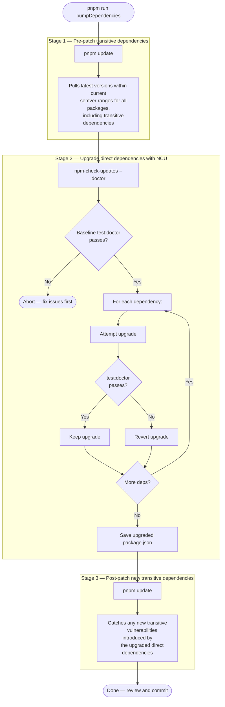
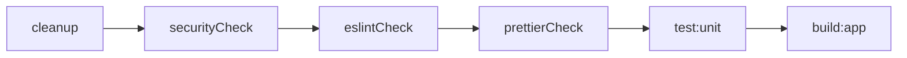
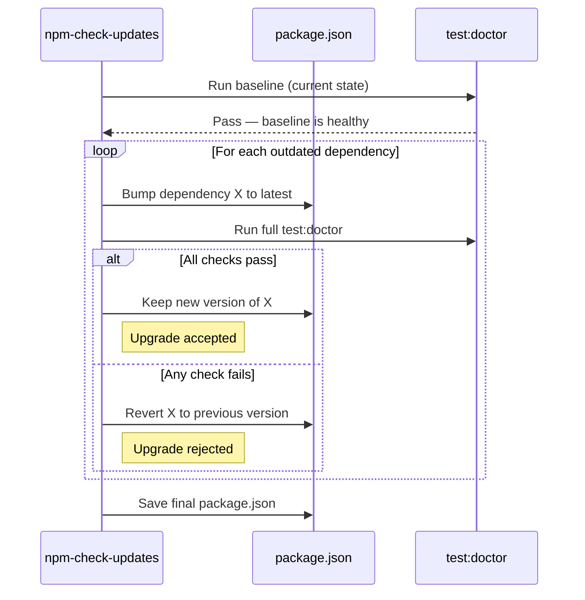

# NestJS Base

Starter kit for building NestJS 11 HTTP services with typed environment configuration, ready-made OpenAPI docs, and a local test pipeline that mirrors your CI workflow.

## Navigation

- [Key features](#key-features)
- [Before you start](#before-you-start)
- [Quick start](#quick-start)
- [Environment variables](#environment-variables)
- [Useful scripts](#useful-scripts)
- [API documentation](#api-documentation)
- [Health check](#health-check)
- [Testing & coverage](#testing--coverage)
- [Namespaced configuration workflow](#namespaced-configuration-workflow)
- [Dependency management and security](#dependency-management-and-security)
- [Next steps](#next-steps)

## Key features

[(back to menu)](#navigation)

- Auto-namespaced configuration classes (`src/config/*.config.ts`) validated with Zod (nestjs-zod) and injected via `@InjectConfig`.
- DTOs rely on Zod (nestjs-zod) for request validation and response serialization.
- Global `/api` prefix, header-based versioning (`X-API-Version`), and a reference health endpoint (`GET /api/health`).
- Swagger UI in development plus a script that produces `api-docs/open-api.json` without booting the server.
- Team-friendly tooling: ESLint, Prettier, Husky + lint-staged, Jest for unit and e2e tests, and a one-shot `test` script that simulates CI.
- `pnpm run bumpDependencies` upgrades dependencies but aborts if the test suite fails.

## Before you start

[(back to menu)](#navigation)

Match your local runtime with the versions declared in the `engines` field inside `package.json`. That field is the source of truth.

## Quick start

[(back to menu)](#navigation)

1. Install dependencies: `pnpm install`.
2. Bootstrap environment variables: `cp .env.example .env`.
3. Adjust the values that apply to your setup.
4. Start the app in watch mode: `pnpm run start:dev`.
5. Open `http://localhost:3000/api/health` to verify the health endpoint.

> For production builds run `pnpm run build:app` and serve it with `pnpm run start:prod`.

## Environment variables

[(back to menu)](#navigation)

Classes in `src/config` define and validate every environment variable the app consumes. They leverage Zod schemas (via `createZodDto`) to map/coerce the raw `.env` namespace into typed objects and enforce constraints before the app finishes booting. Highlights:

| Variable                 | Description                                                                                  | Default                              |
| ------------------------ | -------------------------------------------------------------------------------------------- | ------------------------------------ |
| `APP_ENV`                | Free-form label to describe the deployment (e.g., `local`, `qa`, `prod`).                    | `local`                              |
| `APP_PORT`               | HTTP port exposed by Nest.                                                                   | `3000`                               |
| `APP_HOSTNAME`           | Host interface Nest listens on.                                                              | `0.0.0.0`                            |
| `APP_LOG_LEVELS`         | Comma-separated log levels (`log,error,warn,debug,verbose,fatal` as per Nest’s `useLogger`). | `log,error,warn,debug,verbose,fatal` |
| `APP_ENABLE_CORS`        | Enables CORS middleware.                                                                     | `true`                               |
| `APP_ENABLE_HELMET`      | Enables Helmet security headers.                                                             | `true`                               |
| `APP_ENABLE_COMPRESSION` | Enables gzip compression middleware.                                                         | `true`                               |
| `APP_ENABLE_SWAGGER`     | Mounts Swagger UI/JSON/YAML when true.                                                       | `false`                              |

Each property is defined in the Zod schema and mapped into the final typed config shape. Missing or invalid values stop the boot process with a detailed error.

## Useful scripts

[(back to menu)](#navigation)

| Script                            | Purpose                                                                                                                                   |
| --------------------------------- | ----------------------------------------------------------------------------------------------------------------------------------------- |
| `pnpm run start:dev`              | Start the server with watch mode.                                                                                                         |
| `pnpm run start:prod`             | Run the compiled app from `dist/`.                                                                                                        |
| `pnpm run test`                   | Local “mini CI” that mirrors `.github/workflows/ci.yml`: cleanup, linting, unit tests, e2e tests, API docs build, and application build.  |
| `pnpm run test:static`            | Security audit + ESLint + Prettier checks.                                                                                                |
| `pnpm run test:unit` / `test:e2e` | Run Jest unit or e2e suites.                                                                                                              |
| `pnpm run watch:UT` / `watch:E2E` | Run Jest in watch mode (unit or e2e).                                                                                                     |
| `pnpm run build:api-docs`         | Generate `api-docs/open-api.json`.                                                                                                        |
| `pnpm run securityCheck`          | Run `pnpm audit --audit-level high`. Fails on high or critical vulnerabilities.                                                           |
| `pnpm run securityFix`            | Run `pnpm update` to pull the latest semver-compatible versions of all dependencies, including transitive ones.                           |
| `pnpm run bumpDependencies`       | Full dependency upgrade pipeline with security validation. See [Dependency management and security](#dependency-management-and-security). |
| `pnpm run updatePnpm`             | Update the pnpm package manager itself via `pnpm self-update`.                                                                            |

Husky runs `lint-staged` before every commit to keep formatting and linting green.

## API documentation

[(back to menu)](#navigation)

- When `APP_ENABLE_SWAGGER=true`, Swagger UI is mounted at `http://localhost:3000/api`. JSON is served at `/api/json`, YAML at `/api/yaml`. Any other value (or absence) disables it. CORS/Helmet/Compression are enabled by default unless explicitly set to a falsey value.
- `APP_LOG_LEVELS` accepts the same values as Nest’s `useLogger` (`log,error,warn,debug,verbose,fatal`), comma-separated. Default enables all of them.
- DTO metadata comes from the same Zod schemas that power runtime validation, so the docs stay in sync with your request/response contracts. `cleanupOpenApiDoc` is applied to keep Swagger output aligned with Zod schemas.
- To generate the specification offline, run `pnpm run build:api-docs`. The output lives at `api-docs/open-api.json`.

## Health check

[(back to menu)](#navigation)

`GET /api/health` responds with `{ "status": "OK" }` and accepts:

- `appMeta=true` → adds `name@version` derived from `package.json`.
- `uptime=true` → returns a human-readable uptime using `date-fns`.

Use it as a baseline for your own operational diagnostics.

## Testing & coverage

[(back to menu)](#navigation)

- `pnpm run test:unit` and `pnpm run test:e2e` create coverage reports under `coverage/unit` and `coverage/e2e`. The `.json` files integrate with CI providers.
- View the HTML reports by opening `coverage/unit/index.html` or `coverage/e2e/index.html` in your browser.

## Namespaced configuration workflow

[(back to menu)](#navigation)

`AppConfig` already normalizes `APP_PORT`, `HOSTNAME`, `APP_ENV`, `ENABLE_SWAGGER`, and exposes `npm_package_*` metadata for things like the health endpoint. The gimmick is simple: every config class becomes its own namespace, validated once at boot, frozen to avoid mutation, and injected by type so you get autocomplete + compile-time hints instead of stringly-typed config keys.

### Why this improves DX

- Each class is registered with `registerAs(<ClassName>)`, so Nest creates a stable config namespace per class.
- The `@InjectConfig(FooConfig)` decorator resolves the namespace token via `getConfigToken(FooConfig.name)`, then injects a fully typed instance.
- You never touch `ConfigService.get('string.key')`; you only use the config class directly, keeping refactors safe.
- Validation errors are aggregated and thrown at startup with actionable messages (`z.prettifyError`).
- Instances are sealed + frozen after validation to prevent runtime drift.

### Add your own namespace

1. Create a class in `src/config/foo.config.ts` and export it.
2. Define a Zod schema inline in `createZodDto(...)` with coercion/defaults as needed.
3. Register the class in `AppConfigModule.forRoot({ configClasses: [AppConfig, FooConfig] })`.
4. Inject the validated configuration anywhere via `@InjectConfig(FooConfig)`:

```ts
// src/config/foo.config.ts
import { createZodDto } from 'nestjs-zod';
import { z } from 'zod';

export class FooConfig extends createZodDto(
  z
    .object({
      FOO_FEATURE_FLAG: z.string().min(1),
    })
    .transform((value) => ({
      featureFlag: value.FOO_FEATURE_FLAG,
    })),
) {}
```

```ts
// Anywhere in the app
@Injectable()
export class FooService {
  constructor(@InjectConfig(FooConfig) private readonly foo: FooConfig) {}

  findValue() {
    return this.foo.featureFlag;
  }
}
```

### Advanced behavior

`AppConfigModule` treats every class as a namespaced configuration factory, freezes the instances, and raises descriptive errors when validation fails. The environment provider is executed once per `forRoot` call and cached for all config classes registered in that call.

## Dependency management and security

[(back to menu)](#navigation)

The project ships a semi-automated pipeline that keeps dependencies up to date while ensuring nothing breaks and no new vulnerabilities slip through. The pipeline is split into focused scripts that compose together.

### How `bumpDependencies` works

Running `pnpm run bumpDependencies` executes three stages back-to-back:



**Why three stages?** Direct dependency upgrades (Stage 2) can introduce new transitive dependencies. The final `pnpm update` (Stage 3) ensures those transitive dependencies resolve to the latest patched versions within their semver ranges.

### How `test:doctor` validates each upgrade

NCU runs `test:doctor` as its validation gate for every single dependency upgrade. If any step fails, that specific upgrade is reverted:



| Step            | What it catches                                                                                    |
| --------------- | -------------------------------------------------------------------------------------------------- |
| `securityCheck` | Rejects upgrades that introduce high/critical vulnerabilities via `pnpm audit --audit-level high`. |
| `eslintCheck`   | Catches type errors, unsafe patterns, and breaking API changes surfaced by `typescript-eslint`.    |
| `prettierCheck` | Ensures formatting consistency is preserved.                                                       |
| `test:unit`     | Validates runtime behavior has not regressed.                                                      |
| `build:app`     | Confirms the production build compiles without errors.                                             |

### How NCU doctor mode decides per dependency



### Security infrastructure

The project provides several layers for managing vulnerability risk:

- **`.npmrc`** — `save-exact=true` pins future `pnpm add` operations to exact versions, preventing unintended semver drift.

- **`pnpm.auditConfig.ignoreCves`** — An allowlist in `package.json` for CVEs that have no fix available (typically in deeply nested devDependencies). When a CVE is ignored, the audit still reports it but does not fail the build. This keeps `securityCheck` passing so it can catch new vulnerabilities instead of being permanently broken.

- **`pnpm.overrides`** — Forces specific transitive dependency versions when a parent package pins a vulnerable range. Use sparingly and with bounded version ranges (e.g., `">=3.1.4 <4.0.0"`, not `">=3.1.4"`).

- **Dependabot** — Configured in `.github/dependabot.yml` for both npm and GitHub Actions ecosystems. Sends weekly pull requests grouped by category (nestjs, testing, linting) to reduce PR noise.

### When to use each script

| Scenario                                           | Script                                                        |
| -------------------------------------------------- | ------------------------------------------------------------- |
| Routine dependency maintenance                     | `pnpm run bumpDependencies`                                   |
| Quick patch for a known vulnerability              | `pnpm run securityFix`                                        |
| Check if current dependencies have vulnerabilities | `pnpm run securityCheck`                                      |
| Update the pnpm package manager itself             | `pnpm run updatePnpm`                                         |
| A CVE appears with no available fix                | Add its ID to `pnpm.auditConfig.ignoreCves` in `package.json` |
| A transitive dependency needs a forced version     | Add a bounded override to `pnpm.overrides` in `package.json`  |

## Next steps

[(back to menu)](#navigation)

Build on top of this template by adding your own modules, integrating an ORM (Prisma, TypeORM, Mongoose), setting up queues, or wiring any other NestJS technique your service needs. The project layout and configuration helpers are designed to scale with those additions.
