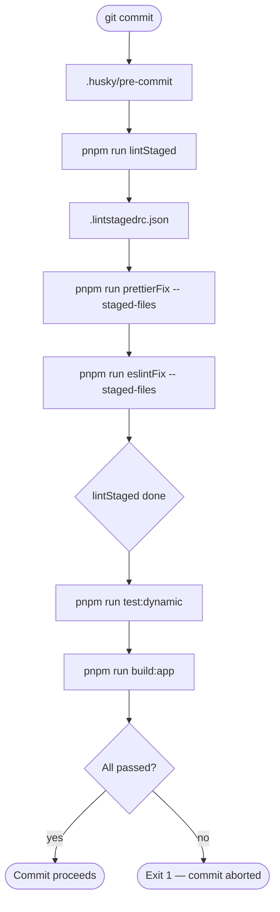
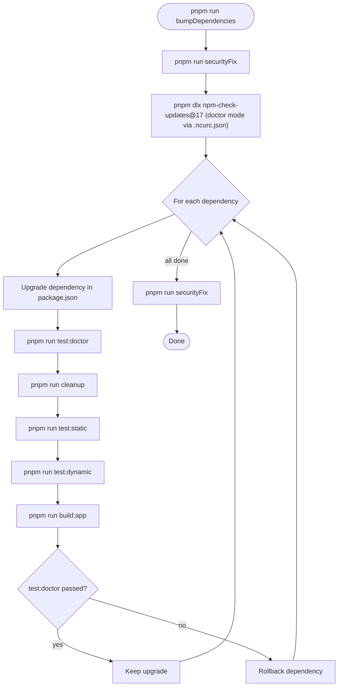

# Quality Gates

Script architecture, pipeline order, and execution context mapping for the echo system.

## Navigation

- [Echo principle](#echo-principle)
- [Script taxonomy](#script-taxonomy)
- [Composite expansion](#composite-expansion)
- [Pipeline order contract](#pipeline-order-contract)
- [Execution context comparison](#execution-context-comparison)
- [Pipeline diagrams](#pipeline-diagrams)
- [Adding a new script](#adding-a-new-script)
- [lint-staged forwarding note](#lint-staged-forwarding-note)
- [Scope difference: lint-staged vs check scripts](#scope-difference-lint-staged-vs-check-scripts)

## Echo Principle

Every atomic script defined in `package.json` is reused with the **identical name** across all execution contexts: local development, lint-staged, pre-commit hook, CI, and bumpDependencies. There are no per-context aliases, renamed wrappers, or inline tool invocations. When a tool call must happen, a named script is the single source of truth — context consumers call the script, not the tool directly.

This eliminates drift: if a script's command changes, every context inherits that change automatically without touching `.lintstagedrc.json`, `.husky/pre-commit`, CI workflow files, or `.ncurc.json`.

**Corollary — lint-staged rule**: `.lintstagedrc.json` MUST NOT call bare tool binaries (`prettier`, `eslint`, etc.). It MUST call `pnpm run <script-name> --` so that lint-staged forwards staged filenames as positional args to the named script.

[(back to menu)](#navigation)

---

## Script Taxonomy

| Script | Type | Category | local-dev | lint-staged | pre-commit | CI | bumpDeps |
|---|---|---|:---:|:---:|:---:|:---:|:---:|
| `start:dev` | atomic | serve | yes | no | no | no | no |
| `start:prod` | atomic | serve | yes | no | no | no | no |
| `test` | composite | pipeline | yes | no | no | ¹ | no |
| `build:app` | atomic | build | yes | no | yes | yes | yes |
| `build:api-docs` | atomic | build | yes | no | no | yes | no |
| `test:doctor` | composite | pipeline | yes | no | no | no | yes |
| `test:static` | composite | check | yes | no | no | ¹ | no |
| `test:dynamic` | atomic | test | yes | no | yes | yes | yes |
| `securityCheck` | atomic | check | yes | no | no | yes | yes |
| `eslintCheck` | atomic | check | yes | no | no | yes | yes |
| `eslintFix` | atomic | fix | yes | yes | no | no | no |
| `prettierCheck` | atomic | check | yes | no | no | yes | yes |
| `prettierFix` | atomic | fix | yes | yes | no | no | no |
| `prepare` | atomic | lifecycle | yes | no | no | no | no |
| `lintStaged` | atomic | orchestration | yes | no | yes | no | no |
| `cleanup` | atomic | housekeeping | yes | no | no | no | yes |
| `securityFix` | atomic | fix | yes | no | no | no | yes |
| `updatePnpm` | atomic | maintenance | yes | no | no | no | no |
| `bumpDependencies` | composite | maintenance | yes | no | no | no | no |

> ¹ CI does not call the `test` or `test:static` composites, but it runs all their constituent atomic scripts individually as separate workflow steps. The effect is equivalent; the difference is CI gets granular step-level reporting.
>
> bumpDeps column: scripts marked `yes` are invoked via `test:doctor` (the NCU validation gate), except `securityFix` which is called directly by `bumpDependencies`. `bumpDependencies` itself is the context, not a participant.

[(back to menu)](#navigation)

---

## Composite Expansion

Each composite script is an ordered `&&` chain of atomic scripts. If any step fails, the chain stops.

| Composite | Expansion |
|---|---|
| `test:static` | `securityCheck` → `eslintCheck` → `prettierCheck` |
| `test:doctor` | `cleanup` → **`test:static`** → `test:dynamic` → `build:app` |
| `test` | `cleanup` → **`test:static`** → `test:dynamic` → `build:api-docs` → `build:app` |
| `bumpDependencies` | `securityFix` → `pnpm dlx npm-check-updates@17` → `securityFix` |

Both `test:doctor` and `test` call `test:static` as a composite — adding a new check to `test:static` propagates to both automatically. `test:doctor` omits `build:api-docs` to keep per-dependency NCU validation cycles fast.

[(back to menu)](#navigation)

---

## Pipeline Order Contract

Scripts are organized into five stages. **No script in stage N may depend on a script from stage N+1 or later.** This is the no-forward-dependency rule.

| Stage | Name | Scripts in Order |
|---|---|---|
| 0 | clone/checkout | — |
| 1 | projectSetup | node install → pnpm install |
| 1.5 | cleanup | `cleanup` (composites that need a clean slate run this first) |
| 2 | test:static | `securityCheck` → `eslintCheck` → `prettierCheck` |
| 3 | test:dynamic | `test:dynamic` (jest — unit + e2e) |
| 4 | build | `build:api-docs` → `build:app` (independent; order matches CI and `test` composite) |

`securityFix` is not assigned a stage — it is a maintenance action invoked only by `bumpDependencies` (pre/post upgrade), not part of the standard pipeline.

[(back to menu)](#navigation)

---

## Execution Context Comparison

Cross-check this matrix against `.lintstagedrc.json`, `.husky/pre-commit`, `.github/workflows/ci.yml`, and `.ncurc.json` to verify consistency.

| Script | local-dev | lint-staged | pre-commit | CI | bumpDeps |
|---|:---:|:---:|:---:|:---:|:---:|
| `securityFix` | optional | no | no | no | yes (pre+post) |
| `lintStaged` | optional | no | yes (first) | no | no |
| `prettierFix` | optional | yes | no (via lintStaged) | no | no |
| `eslintFix` | optional | yes | no (via lintStaged) | no | no |
| `cleanup` | optional | no | no | no | yes (via test:doctor) |
| `securityCheck` | optional | no | no | yes | yes (via test:doctor) |
| `eslintCheck` | optional | no | no | yes | yes (via test:doctor) |
| `prettierCheck` | optional | no | no | yes | yes (via test:doctor) |
| `test:dynamic` | optional | no | yes | yes | yes (via test:doctor) |
| `build:api-docs` | optional | no | no | yes | no |
| `build:app` | optional | no | yes (last) | yes | yes (via test:doctor) |

CI runs check scripts (read-only), not fix scripts. Fix scripts are pre-commit only. bumpDependencies uses `test:doctor` as its validation gate (which calls `test:static` as a composite) — NCU rolls back any dependency whose upgrade causes `test:doctor` to fail.

[(back to menu)](#navigation)

---

## Pipeline Diagrams

### Pre-commit



### bumpDependencies



[(back to menu)](#navigation)

---

## Adding a New Script

Adding a new script to the echo system is a two-step process:

1. Add the atomic script to `package.json`
2. Hook it into the relevant composite (`test:static`, `test:dynamic`, or `build` stage of `test`/`test:doctor`)

That's it. All contexts inherit the change through the composite chain:

- `test:static` propagates to → `test`, `test:doctor`, and indirectly to `bumpDependencies` (via `test:doctor`)
- `test:dynamic` is a single jest call — new test files are picked up automatically via jest config
- Build scripts in `test`/`test:doctor` propagate to all contexts that call those composites

CI runs composite children as individual workflow steps for granular GitHub step summaries. If you add a new atomic to an existing composite, CI will also need a corresponding step — but this is the ONE exception, and it only applies to CI.

[(back to menu)](#navigation)

---

## lint-staged Forwarding Note

`prettierFix` and `eslintFix` are defined **without a glob** (`prettier --write`, `eslint --fix`) because lint-staged passes the list of staged filenames as trailing arguments. Using `pnpm run prettierFix --` causes pnpm to forward everything after `--` directly to the underlying tool, so each staged file is processed individually.

If a glob were embedded in the script (e.g., `prettier --write '{src}/**/*.ts'`), pnpm would append the staged filenames AFTER the glob, causing the glob matches to be formatted as well. Option A (no glob in the script) is intentional and verified.

When invoking these scripts standalone during local development, pass the glob explicitly:

```bash
pnpm run prettierFix -- '{apps,libs,scripts,src,test}/**/*.ts'
pnpm run eslintFix -- '{apps,libs,scripts,src,test}/**/*.ts'
```

[(back to menu)](#navigation)

---

## Scope Difference: lint-staged vs Check Scripts

`.lintstagedrc.json` targets `*.{js,json,mjs,ts,tsx}` — five file extensions. The check scripts (`eslintCheck`, `prettierCheck`) only target `*.ts` files within specific directories.

This means lint-staged applies fixes to `.js`, `.json`, `.mjs`, and `.tsx` files during pre-commit, but CI's check scripts only verify `.ts` files. A formatting regression in a non-`.ts` file would be caught by pre-commit but NOT by CI.

This is intentional: lint-staged fixes everything it touches before committing, while CI validates the primary source files. The broader lint-staged glob acts as a first-pass safety net.

[(back to menu)](#navigation)
